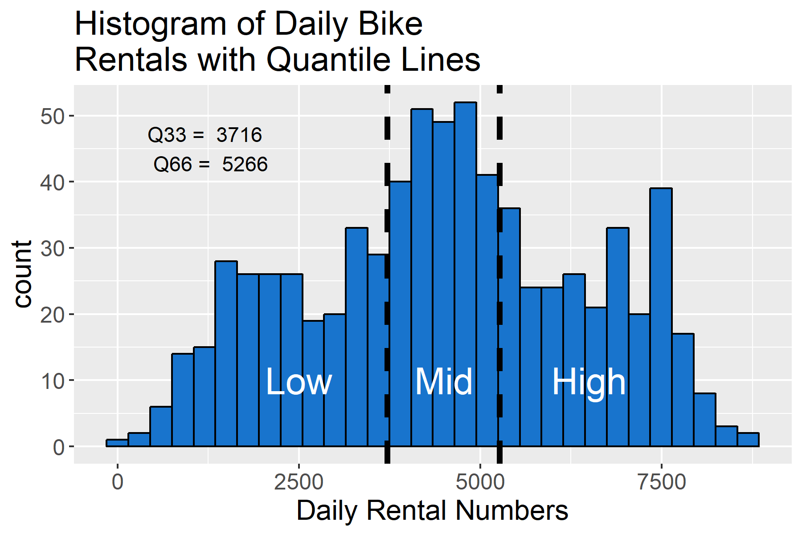
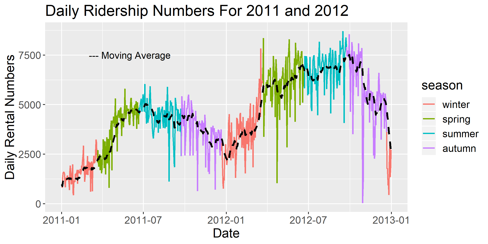

Top Predictors for Daily Ridership in the Capital Bike Share System
================
Mike Yuan and Evan Yathon
2018-11-24

Bike sharing systems are increasingly popular in urban centres as an easy and effective way for people to get from one location to another; in the United States, [bike ridership grew](https://nacto.org/bike-share-statistics-2016/) from 320,000 yearly trips in 2010 to 28 million in 2016 1. Weather, temperature and season are some motivators behind the choice to use a bike sharing service for commuting. Knowing the factors that influence whether a person chooses to rent a bike on a particular day is important to forecast usage and understand drivers behind daily bike rentals. This is why we chose to investigate the top three predictors of rental bike ridership using the [Capital Bike Share Dataset](https://archive.ics.uci.edu/ml/datasets/bike+sharing+dataset)2.

### What are the top three predictors of rental bike ridership?

To answer this question, we decided to use a decision tree to predict daily ridership. Our approach required the ridership to be split into categories; below is a histogram visualizing that split.

##### Figure 1. Histogram of daily bike ridership, separated into thirds.

Figure 1 gives an idea of the daily ridership count from the Capital Bikeshare system in Washington, D.C. over the period of two years. Our decision was to split daily ridership into equal thirds so that the decision tree would have an equal split of target categories to learn from. The resulting categories are low, mid and high ridership numbers on a daily basis.

There are many different features in the dataset, including temperature, humidity and weather conditions.

References
----------

1.  [Nacto Bike Share Statistic 2016](https://nacto.org/bike-share-statistics-2016/)
2.  [Capital Bike Share Dataset](https://archive.ics.uci.edu/ml/datasets/bike+sharing+dataset)
    -   Used the `day.csv` dataset.
3.
